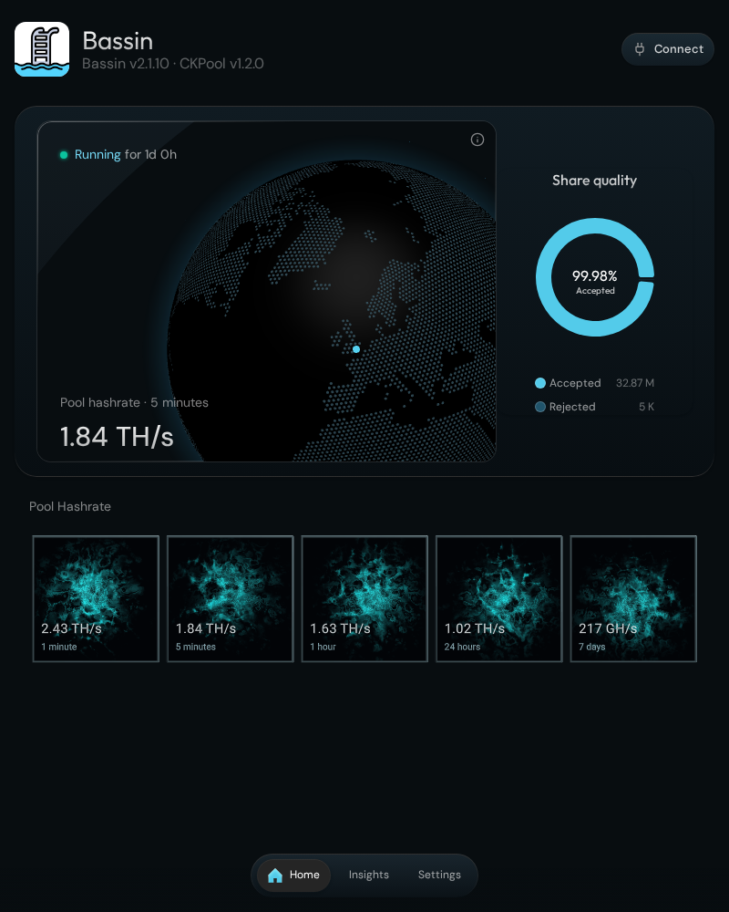
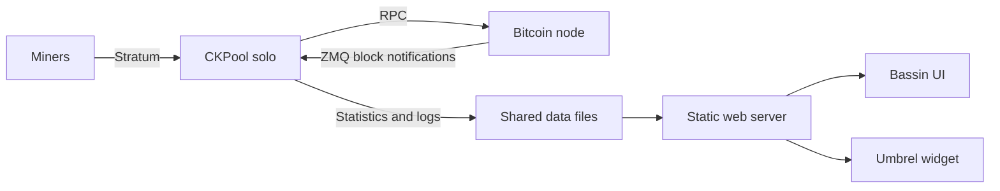

<p align="center">
  
</p>

# Bassin

A zero-fee Bitcoin solo mining pool for Umbrel. Connect your miners to your own Bitcoin node, follow their progress, and keep the full block reward if one of them finds a block.

Bassin combines [CKPool](https://github.com/ckolivas/ckpool) with a dashboard built from the official [Umbrel Bitcoin UI](https://github.com/getumbrel/umbrel-bitcoin/tree/master/apps/ui). The new interface keeps Bassin’s water colours while bringing the familiar Umbrel layout, typography, navigation, and room for better mining tools.

**Current community release: Bassin v2.1.10 with CKPool v1.2.0.** Install it through the [Blockdyor community app store](https://github.com/blockdyor/blockdyor-umbrel-community-app-store). The official Umbrel listing follows a separate release schedule; the [proposal to bring the redesigned UI and CKPool 1.2.0 to it](https://github.com/getumbrel/umbrel-apps/pull/6167) is pending as of 9 October 2026.



*Screenshots use sample mining data, not a live pool.*

## What’s inside

- **Home:** interactive globe, accepted/rejected share quality, and hashrate averages from one minute to seven days.
- **Insights:** workers, round best share, best share ever, share rate, uptime, a hashrate chart, and searchable worker details.
- **Settings:** mining options, Bitcoin Core RPC connection fields, clearer ZMQ notification and polling controls, and an advanced JSON editor.
- **Logs:** searchable pool logs with pause, follow, and download controls.
- **Worker setup:** Stratum connection details and a QR code. The default solo configuration pays the successful miner’s Bitcoin address the full block subsidy and transaction fees, with no pool commission.
- **UTC throughout:** a UTC clock in Insights, UTC chart and worker timestamps, and the original UTC pool logs.
- **Version visibility:** the header shows the Bassin version and detects the installed CKPool version when metadata is available.
- **Mobile improvements:** responsive layouts, readable chart tooltips, reduced graphics load on touch devices, and a static globe fallback if graphics are interrupted.
- **Umbrel widget:** pool statistics on your umbrelOS dashboard.

**Settings currently imports, edits, and exports a configuration file. It does not load or apply the running pool configuration.** Import your existing `ckpool.conf` before editing; see [Settings and notifications](docs/settings.md) for the complete workflow.

## Install and connect

1. Run a fully synchronized Bitcoin node on Umbrel.
2. For the current community release, add this repository URL in Umbrel’s community app store settings:

   ```text
   https://github.com/blockdyor/blockdyor-umbrel-community-app-store
   ```

3. Install Bassin from that store and open **Connect → Worker Setup**.
4. Configure your miner with the following values:

   | Miner setting | Value |
   | --- | --- |
   | Pool URL | `stratum+tcp://<your-Umbrel-address>:3456` |
   | Username | `<your-bitcoin-address>.<worker-name>` |
   | Password | `x` |

Use a receiving address from your own Bitcoin wallet. Replace the angle-bracket placeholders; `user.worker` is not a valid substitute for your Bitcoin address. Solo mining does not provide regular payouts for submitted shares.

The [official Umbrel App Store listing](https://apps.umbrel.com/app/bassin) is also available, but may have an older release. Read the [installation guide](docs/getting-started.md) before switching channels: the apps have different IDs and data directories, and both use Stratum port `3456`.

## Documentation

- [Getting started, updates, and release channels](docs/getting-started.md)
- [Settings, ZMQ, polling, and applying a configuration](docs/settings.md)
- [FAQ: shares, history, UTC, versions, privacy, and troubleshooting](docs/FAQ.md)
- [What changed in the redesigned Bassin](docs/whats-new.md)
- [GitHub Wiki](https://github.com/blockdyor/bassin/wiki)

## Project repositories

| Repository | Purpose |
| --- | --- |
| [Bassin](https://github.com/blockdyor/bassin) | Project overview, documentation, support, and shared app assets |
| [Bassin UI](https://github.com/blockdyor/bassin-ui) | Dashboard source, builds, and UI development instructions |
| [CKPool Solo container](https://github.com/blockdyor/docker-ckpool-solo) | Blockdyor-maintained packaging of upstream CKPool |
| [Bassin widget](https://github.com/blockdyor/umbrel-bassin-widget) | Umbrel dashboard widget |
| [Blockdyor community package](https://github.com/blockdyor/blockdyor-umbrel-community-app-store/tree/master/blockdyor-bassin) | Current community deployment and release manifest |
| [Official Umbrel package](https://github.com/getumbrel/umbrel-apps/tree/master/bassin) | Official deployment, reviewed and released separately |

The `duckaxe-bassin/` directory and `umbrel-app-store.yml` in this repository are legacy packaging. Use the maintained store repositories above for installation; the legacy package does not represent the current community release. Existing icon and gallery paths remain available for store integrations.

## How it works



The pool continues mining when the browser is closed. The UI reads pool statistics and logs; its live chart samples are collected during your visit. See the [FAQ](docs/FAQ.md) for the difference between chart history and CKPool’s saved statistics.

## Credits and licensing

Bassin was created by [duckaxe](https://github.com/duckaxe) and is now maintained by [blockdyor](https://github.com/blockdyor). Thanks to [Umbrel](https://umbrel.com) for the Bitcoin app UI and app platform, and to [Con Kolivas and CKPool contributors](https://github.com/ckolivas/ckpool) for the mining backend.

This repository retains its [GPLv3 license](LICENSE). The UI includes upstream code with its own licensing terms; consult [Bassin UI’s third-party notices](https://github.com/blockdyor/bassin-ui/blob/main/THIRD_PARTY_NOTICES.md) before reusing or redistributing it.

For academic and research purposes only.

For bugs and feature requests, [open an issue](https://github.com/blockdyor/bassin/issues). For vulnerabilities, follow the [security policy](SECURITY.md) and keep credentials out of public reports.
