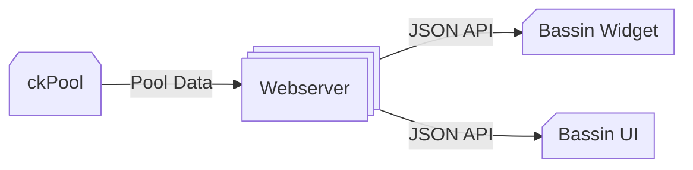

  
   
   
  A zero-fee Bitcoin solo mining pool for <a href="https://apps.umbrel.com/app/bassin">Umbrel</a>.
   
  Run your own ckPool at home.

### Install
1. Install `Bassin` directly from the [Umbrel App Store](https://apps.umbrel.com/app/bassin)
2. Open the `Bassin` app, then follow the on-screen instructions
3. Find the Bitcoin block 🎉

### Wiki
* [FAQ](https://github.com/duckaxe/bassin/wiki/FAQ)

### Repositories
* [Bassin UI](https://github.com/blockdyor/bassin-ui)
* [Bassin Widget](https://github.com/duckaxe/umbrel-bassin-widget)
* [Bassin @ Umbrel](https://github.com/getumbrel/umbrel-apps/tree/master/bassin)
* [Bassin @ blockdyor Community Store](https://github.com/blockdyor/blockdyor-umbrel-community-app-store/tree/master/blockdyor-bassin)
* [ckPool Docker Image](https://github.com/getumbrel/docker-ckpool-solo/pkgs/container/docker-ckpool-solo)

### Dataflow

### Thanks
A big shout out to [duckaxe](https://github.com/duckaxe), who's since moved on to other things, for originally creating this app. I've picked it back up and am keeping it alive with ongoing updates. Also thanks to the [Umbrel](https://umbrel.com) team for their fantastic support in creating and publishing the app.

### Legal
For academic and research purposes only.
