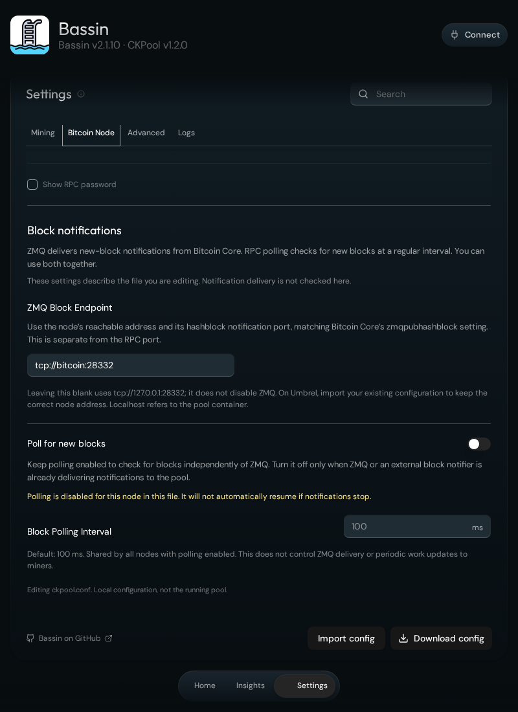

# Settings and Bitcoin node notifications

[Back to Bassin](../README.md)

These instructions describe Bassin 2.1.10. Open **Settings → Bitcoin Node** for the Bitcoin Core connection, ZMQ endpoint, and polling controls.

## What the editor does

Settings is a local **import → edit → download** configuration editor. It does not read the running pool configuration, test the node connection, save changes to the server, or restart the pool.

Before importing a file, the form shows a starter template. Its values are not evidence of what your running pool is using. Downloading a file does not apply it.

Credentials remain in browser-tab memory and in the file you explicitly download. Moving between app screens keeps pending edits; reloading the app clears them. Imported additional nodes and unknown options are preserved. Use **Advanced** to edit the full JSON, including additional nodes.

## Apply an intentional change

1. Locate and back up the actual `data/config/ckpool.conf` in your Bassin app’s data directory. Keep the backup private.
2. Import that file into Settings. Review the values before editing.
3. Make your changes and resolve validation errors, then select **Download config**.
4. Stop Bassin through Umbrel before replacing its active configuration. This temporarily interrupts mining through the pool.
5. Replace `data/config/ckpool.conf` with the downloaded file, preserving its ownership and permissions so the pool’s UID/GID `1000:1000` can read it.
6. Start Bassin and check **Settings → Logs** and your miners for successful reconnection. If the change fails, stop the app and restore the backup.

For an existing current community installation, edit the active `.conf` file, not just `ckpool.conf.template`: the template is only used when the active file is missing. Older or custom packages can have different startup behaviour; inspect their deployment before applying these instructions.

Never put configuration or backup files in `data/www`; that directory is web-served. The downloaded configuration contains your RPC password.

## Bitcoin Core connection

**RPC Host and Port**, **RPC Username**, and **RPC Password** connect the pool to your Bitcoin node. Preserve the values generated by the Umbrel package unless you are deliberately changing the node.

In Advanced, these fields appear under `btcd`. That is CKPool’s configuration name for its list of Bitcoin node connections; it does not mean you are using the separate btcd node implementation. For example, `btcd[0].pass` means the first node’s RPC password. Bitcoin Core’s daemon is `bitcoind`.

## ZMQ notifications and polling

The standard community package already configures a ZMQ hashblock endpoint. A working standard installation needs no notification changes merely because the UI was updated.

| Setting or mechanism | Meaning |
| --- | --- |
| **ZMQ Block Endpoint** | The address from which the pool receives Bitcoin Core’s new-block messages. Match the node’s `zmqpubhashblock` publisher using an address reachable from the pool container. This is separate from the RPC port. |
| **Poll for new blocks: on** | Enables periodic RPC checks for the first configured node; stores `notify: false`. ZMQ can still deliver notifications alongside polling. |
| **Poll for new blocks: off** | Disables those RPC checks; stores `notify: true`. Only use this when ZMQ or an external notifier is delivering block notifications. Polling will not automatically resume if those notifications stop. |
| **Block Polling Interval** | Milliseconds between checks for nodes with polling enabled. The default is `100` ms, and the value is shared by all such nodes. |
| Bitcoin Core’s **`blocknotify`** | A separate mechanism that runs a command when a block event occurs. It is not the polling switch and is not required for Bassin’s standard ZMQ setup. |

The polling switch only edits the first node; additional nodes keep their own notification settings. A filled-in endpoint is configuration, not a verified connection status. The UI does not currently observe or confirm notification delivery.

Use an endpoint such as `tcp://<node-address>:<hashblock-port>`, with a port from 1 to 65535. IPv6 literals need brackets. Use a reachable node address rather than a wildcard bind address such as `0.0.0.0`.

**Clearing the ZMQ field does not disable ZMQ.** With no explicit endpoint, CKPool uses `tcp://127.0.0.1:28332`. In the pool container, localhost means that container, not the separate Bitcoin node container. Importing the existing configuration preserves the correct Umbrel address.

## Other settings

**Mining** contains minimum, starting, and maximum share difficulty plus the coinbase signature. The community template uses minimum `1`, starting `42`, and maximum `0` (no maximum). Automatic difficulty adjustment is handled by CKPool.

**Advanced** includes periodic work updates and the full configuration JSON. The default work update interval is 30 seconds; it is separate from detecting a new block. Keep `logdir` as `/www` in the standard deployment so the UI can read statistics and logs. Changing Stratum listeners also requires corresponding container port changes.

## CKPool 1.2.0 and IPC

The current `blockdyor/docker-ckpool-solo:v1.2.0-1` image includes ZMQ support, but not the optional Cap’n Proto dependencies for mining IPC. Adding `ipcmining` or `ipctemplate` in Advanced will not make IPC available in that image. A future IPC integration also requires a compatible Bitcoin node and a shared, accessible socket.

The [pinned upstream configuration reference](https://github.com/ckolivas/ckpool/blob/2e44101e2da2c11f499be76d16e6a26cd95cfea7/README) and [container build](https://github.com/blockdyor/docker-ckpool-solo/blob/v1.2.0-1/Dockerfile) describe the underlying options and compiled capabilities.

*Sample configuration for documentation; no real RPC credentials are shown.*
