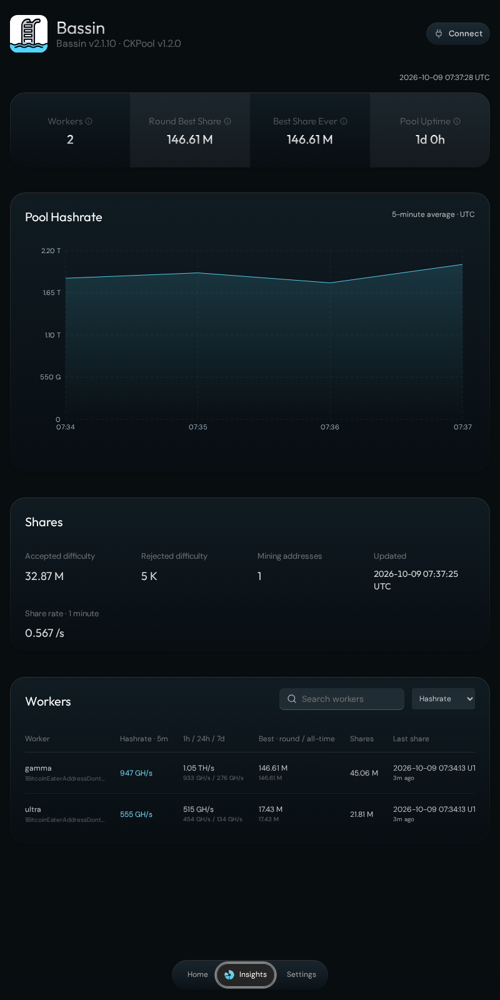

# The redesigned Bassin

[Back to Bassin](../README.md)

This guide covers the changes now available in the community release through **2.1.10**. Store release notes and [Bassin UI pull requests](https://github.com/blockdyor/bassin-ui/pulls?q=is%3Apr+is%3Amerged) provide the implementation history.

## A UI built from Umbrel Bitcoin

The original dashboard had become limiting as Bassin grew. The new direction refactors the official [Umbrel Bitcoin app UI](https://github.com/getumbrel/umbrel-bitcoin/tree/master/apps/ui) for solo mining, using its actual components and styling as the foundation.

Bassin keeps its water colours and identity while adopting the familiar Umbrel typography, floating navigation dock, cards, settings layout, dialogs, charts, and interactive globe. The aim is a consistent experience alongside the Bitcoin node app and more room to improve mining information and controls. Source attribution and applicable licenses are recorded in the UI’s [third-party notices](https://github.com/blockdyor/bassin-ui/blob/main/THIRD_PARTY_NOTICES.md).

## Mining information and controls

Home combines the pool’s hashrate, share-quality ring, and five hashrate averages. Insights adds worker details, share rate, uptime, round best share, best share ever, and a chart of samples collected during the visit. The distinction between a round record and retained lifetime worker records is explained in the [FAQ](FAQ.md#what-are-round-best-share-and-best-share-ever).

Connect includes Stratum details, a QR code, and worker setup instructions explaining the full solo block reward and zero pool commission. Settings offers a local configuration editor and a searchable log viewer. GitHub support links are accessible from the interface.

*Sample mining data for documentation.*

## Readability, time, and mobile behaviour

All displayed dates and times use UTC, with a clock in Insights. Chart tooltips and Bitcoin node fields have explicit readable colours. The header shows Bassin’s version and detects CKPool’s version from installed-binary metadata rather than a manually entered UI value.

The globe supports dragging and can show one pulsing blue marker from the Bitcoin node’s reported public IP. It never locates the dashboard visitor. [The FAQ describes the location lookup and privacy details](FAQ.md#what-does-the-globes-blue-marker-represent).

Mobile work includes small-screen layout corrections, explicit graphics cleanup during navigation, reduced drawing resolution on touch devices, and a static globe fallback after graphics-context loss. Browser checks cover Chromium and WebKit, including repeated navigation and narrow viewports.

## Notification settings in 2.1.10

The old “Block Notifications” switch was ambiguous: its configuration flag actually controlled whether the node needed RPC polling. The new **Poll for new blocks** switch states that behaviour directly and keeps it independent of the ZMQ endpoint.

The polling interval now sits with notification settings. ZMQ has clearer hashblock and port guidance plus inline address validation. Plain Bitcoin Core RPC labels replace raw `btcd[0]` field labels, and settings search can find node and notification options.

These remain file-editing controls. They do not test notification delivery or apply the running configuration. See [Settings and notifications](settings.md).

## The CKPool container

The community release uses [Blockdyor’s CKPool Solo container](https://github.com/blockdyor/docker-ckpool-solo), currently packaging upstream CKPool 1.2.0 for amd64 and arm64. The image is pinned by digest in the store manifest. Packaging uses a pinned upstream source revision, portable compilation settings, a non-root runtime, and ZMQ support.

Maintaining this container lets Bassin’s backend and UI changes be tested and released together. The mining software remains upstream CKPool; this is a maintained packaging path. Work proposed for Umbrel’s container is tracked in [getumbrel/docker-ckpool-solo PR #9](https://github.com/getumbrel/docker-ckpool-solo/pull/9).

This release does not enable optional mining IPC or add Stratum V2. Backend improvements do not increase an ASIC’s physical hashrate. Available capabilities are described in the [settings guide](settings.md#ckpool-120-and-ipc).

## Official and community releases

The current community release is available through [Blockdyor’s store](https://github.com/blockdyor/blockdyor-umbrel-community-app-store/tree/master/blockdyor-bassin). The proposal for the official store is [Umbrel apps PR #6167](https://github.com/getumbrel/umbrel-apps/pull/6167); it remains under review as of 9 October 2026. A community update does not automatically update the official listing.
